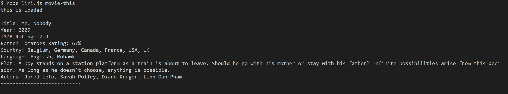
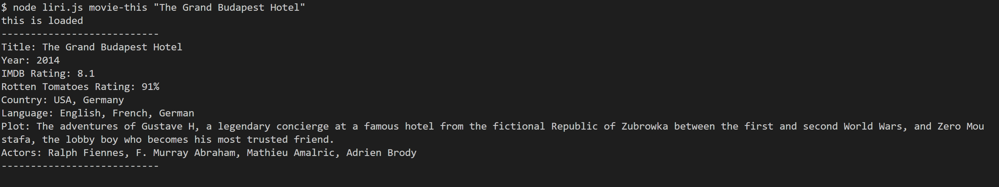

# LIRI Bot

LIRI is a *Language Interpretation and Recognition Interface*.

## Commands

- ```node liri.js concert-this <band or artist name>```
  - 
    
  - Returns a list of concerts that the band will be performing with the days and venues from Bandsintown.
- ```node liri.js spotify-this-song <song name>```
  - 
    
  - Returns a list of songs with their album and artists based off of the song title from Spotify.
- ```node liri.js movie-this <movie name>```
  - 
    
  - Returns movie information (including year released, IMDB and Rotten Tomatoes ratings, country, language, plot, and actors) for a movie from OMDb.
- ```node liri.js do-what-it-says```
  -  
  - Returns random information for bands, songs, and movies.